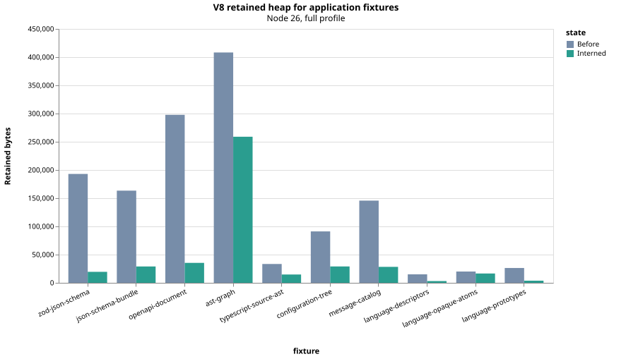
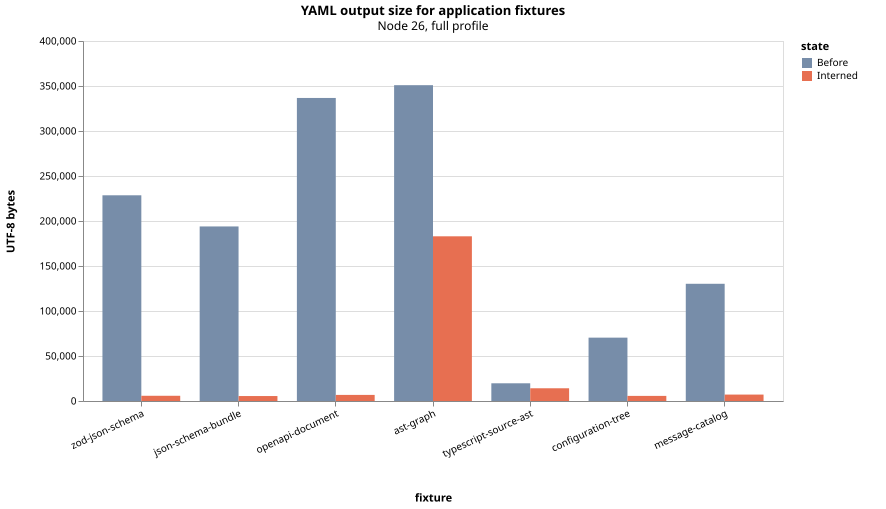
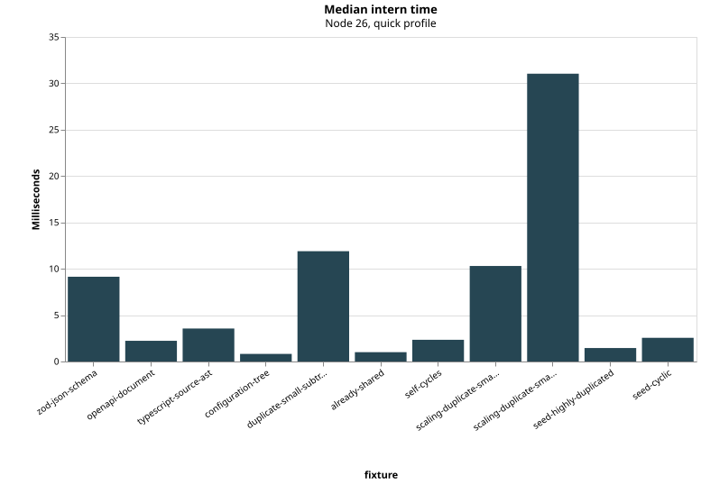
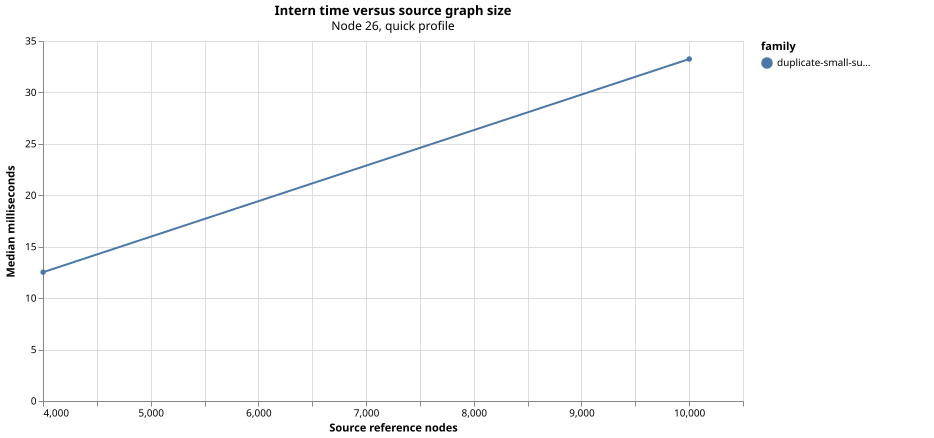
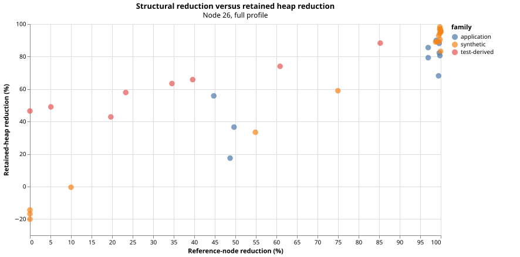
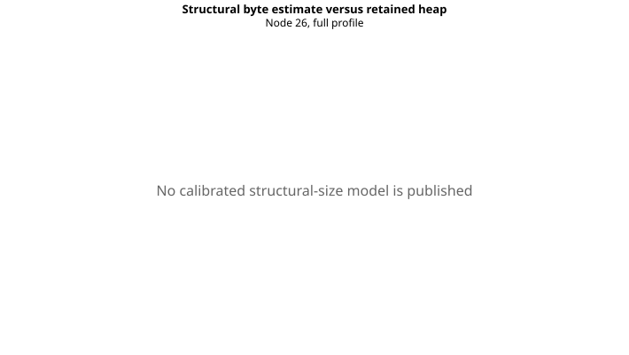

# Interner benchmark report

Generated from benchmark schema 1.0.0 using profile `quick`.

Runtime: Node v26.2.0 (V8 14.6.202.34-node.20), linux/x64.

[Machine-readable results](results.json) | [Summary](summary.json)

## Plots

## zod-json-schema

JSON Schema generated from a checked-in Zod source definition using Zod's supported conversion API.

Parameters: `{"fields":16}`

### Structure

| Metric | Before | After | Absolute delta | Percentage delta |
| --- | ---: | ---: | ---: | ---: |
| Object nodes | 377 | 19 | -358 | -95.0% |
| Array nodes | 59 | 6 | -53 | -89.8% |
| Date nodes | 0 | 0 | 0 | n/a |
| RegExp nodes | 0 | 0 | 0 | n/a |
| Edges | 1,593 | 115 | -1,478 | -92.8% |
| Object properties | 1,294 | 79 | -1,215 | -93.9% |
| Array elements | 299 | 36 | -263 | -88.0% |
| Array holes | 0 | 0 | 0 | n/a |
| String occurrences | 745 | 53 | -692 | -92.9% |
| String code units | 7,947 | 564 | -7,383 | -92.9% |
| Numbers | 355 | 8 | -347 | -97.7% |
| BigInts | 0 | 0 | 0 | n/a |
| Booleans | 58 | 5 | -53 | -91.4% |
| Nulls | 0 | 0 | 0 | n/a |
| Undefined values | 0 | 0 | 0 | n/a |
| Reference nodes | 436 | 25 | -411 | -94.3% |

### Retained heap

| State | Median | Minimum | Maximum | Samples |
| --- | ---: | ---: | ---: | ---: |
| Before | 38.9 KiB | 38.9 KiB | 38.9 KiB | 1 |
| After | 8.9 KiB | 8.9 KiB | 8.9 KiB | 1 |
| Change | -30.0 KiB | | | -77.2% |

### Serialization and timing

Percentage deltas use `(after - before) / before * 100`. End-to-end YAML time compares source YAML serialization with `intern()` plus YAML serialization.

| Measurement | Before | After | Absolute delta | Percentage delta |
| --- | ---: | ---: | ---: | ---: |
| YAML UTF-8 bytes | 41.6 KiB | 2.4 KiB | -39.3 KiB | -94.3% |
| JSON UTF-8 bytes | 25.6 KiB | 25.6 KiB | 0 B | 0.0% |
| Intern transformation time | n/a | 9.78 ms | n/a | n/a |
| YAML serialization time | 11.4 ms | 9.59 ms | -1.86 ms | -16.2% |
| End-to-end YAML time | 11.4 ms | 9.25 ms | -2.20 ms | -19.2% |

## openapi-document

An OpenAPI-like document with repeated parameters, responses and schemas.

Parameters: `{"paths":24}`

### Structure

| Metric | Before | After | Absolute delta | Percentage delta |
| --- | ---: | ---: | ---: | ---: |
| Object nodes | 483 | 20 | -463 | -95.9% |
| Array nodes | 48 | 2 | -46 | -95.8% |
| Date nodes | 0 | 0 | 0 | n/a |
| RegExp nodes | 0 | 0 | 0 | n/a |
| Edges | 1,205 | 69 | -1,136 | -94.3% |
| Object properties | 1,085 | 64 | -1,021 | -94.1% |
| Array elements | 120 | 5 | -115 | -95.8% |
| Array holes | 0 | 0 | 0 | n/a |
| String occurrences | 411 | 17 | -394 | -95.9% |
| String code units | 3,104 | 142 | -2,962 | -95.4% |
| Numbers | 240 | 4 | -236 | -98.3% |
| BigInts | 0 | 0 | 0 | n/a |
| Booleans | 24 | 1 | -23 | -95.8% |
| Nulls | 0 | 0 | 0 | n/a |
| Undefined values | 0 | 0 | 0 | n/a |
| Reference nodes | 531 | 22 | -509 | -95.9% |

### Retained heap

| State | Median | Minimum | Maximum | Samples |
| --- | ---: | ---: | ---: | ---: |
| Before | 28.5 KiB | 28.5 KiB | 28.5 KiB | 1 |
| After | 10.7 KiB | 10.7 KiB | 10.7 KiB | 1 |
| Change | -17.9 KiB | | | -62.6% |

### Serialization and timing

Percentage deltas use `(after - before) / before * 100`. End-to-end YAML time compares source YAML serialization with `intern()` plus YAML serialization.

| Measurement | Before | After | Absolute delta | Percentage delta |
| --- | ---: | ---: | ---: | ---: |
| YAML UTF-8 bytes | 31.6 KiB | 1.6 KiB | -30.0 KiB | -94.9% |
| JSON UTF-8 bytes | 17.1 KiB | 17.1 KiB | 0 B | 0.0% |
| Intern transformation time | n/a | 2.16 ms | n/a | n/a |
| YAML serialization time | 4.12 ms | 2.33 ms | -1.79 ms | -43.4% |
| End-to-end YAML time | 4.12 ms | 2.11 ms | -2.00 ms | -48.7% |

## typescript-source-ast

A portable TypeScript AST parsed from the source of its own fixture module.

Parameters: `{}`

### Structure

| Metric | Before | After | Absolute delta | Percentage delta |
| --- | ---: | ---: | ---: | ---: |
| Object nodes | 219 | 144 | -75 | -34.2% |
| Array nodes | 219 | 98 | -121 | -55.3% |
| Date nodes | 0 | 0 | 0 | n/a |
| RegExp nodes | 0 | 0 | 0 | n/a |
| Edges | 747 | 521 | -226 | -30.3% |
| Object properties | 529 | 324 | -205 | -38.8% |
| Array elements | 218 | 197 | -21 | -9.6% |
| Array holes | 0 | 0 | 0 | n/a |
| String occurrences | 310 | 180 | -130 | -41.9% |
| String code units | 3,692 | 2,499 | -1,193 | -32.3% |
| Numbers | 0 | 0 | 0 | n/a |
| BigInts | 0 | 0 | 0 | n/a |
| Booleans | 0 | 0 | 0 | n/a |
| Nulls | 0 | 0 | 0 | n/a |
| Undefined values | 0 | 0 | 0 | n/a |
| Reference nodes | 438 | 242 | -196 | -44.7% |

### Retained heap

| State | Median | Minimum | Maximum | Samples |
| --- | ---: | ---: | ---: | ---: |
| Before | 32.6 KiB | 32.6 KiB | 32.6 KiB | 1 |
| After | 14.4 KiB | 14.4 KiB | 14.4 KiB | 1 |
| Change | -18.2 KiB | | | -55.8% |

### Serialization and timing

Percentage deltas use `(after - before) / before * 100`. End-to-end YAML time compares source YAML serialization with `intern()` plus YAML serialization.

| Measurement | Before | After | Absolute delta | Percentage delta |
| --- | ---: | ---: | ---: | ---: |
| YAML UTF-8 bytes | 19.2 KiB | 13.8 KiB | -5.4 KiB | -28.2% |
| JSON UTF-8 bytes | 9.9 KiB | 9.9 KiB | 0 B | 0.0% |
| Intern transformation time | n/a | 3.26 ms | n/a | n/a |
| YAML serialization time | 3.16 ms | 4.38 ms | 1.21 ms | 38.4% |
| End-to-end YAML time | 3.16 ms | 4.54 ms | 1.38 ms | 43.5% |

## configuration-tree

A generated service configuration tree with repeated runtime policies.

Parameters: `{"services":24}`

### Structure

| Metric | Before | After | Absolute delta | Percentage delta |
| --- | ---: | ---: | ---: | ---: |
| Object nodes | 122 | 7 | -115 | -94.3% |
| Array nodes | 24 | 1 | -23 | -95.8% |
| Date nodes | 0 | 0 | 0 | n/a |
| RegExp nodes | 0 | 0 | 0 | n/a |
| Edges | 361 | 39 | -322 | -89.2% |
| Object properties | 337 | 38 | -299 | -88.7% |
| Array elements | 24 | 1 | -23 | -95.8% |
| Array holes | 0 | 0 | 0 | n/a |
| String occurrences | 168 | 7 | -161 | -95.8% |
| String code units | 1,056 | 44 | -1,012 | -95.8% |
| Numbers | 48 | 2 | -46 | -95.8% |
| BigInts | 0 | 0 | 0 | n/a |
| Booleans | 0 | 0 | 0 | n/a |
| Nulls | 0 | 0 | 0 | n/a |
| Undefined values | 0 | 0 | 0 | n/a |
| Reference nodes | 146 | 8 | -138 | -94.5% |

### Retained heap

| State | Median | Minimum | Maximum | Samples |
| --- | ---: | ---: | ---: | ---: |
| Before | 8.6 KiB | 8.6 KiB | 8.6 KiB | 1 |
| After | 4.5 KiB | 4.5 KiB | 4.5 KiB | 1 |
| Change | -4.1 KiB | | | -48.1% |

### Serialization and timing

Percentage deltas use `(after - before) / before * 100`. End-to-end YAML time compares source YAML serialization with `intern()` plus YAML serialization.

| Measurement | Before | After | Absolute delta | Percentage delta |
| --- | ---: | ---: | ---: | ---: |
| YAML UTF-8 bytes | 6.6 KiB | 771 B | -5.8 KiB | -88.6% |
| JSON UTF-8 bytes | 5.5 KiB | 5.5 KiB | 0 B | 0.0% |
| Intern transformation time | n/a | 0.67 ms | n/a | n/a |
| YAML serialization time | 1.29 ms | 0.94 ms | -0.34 ms | -26.7% |
| End-to-end YAML time | 1.29 ms | 0.96 ms | -0.33 ms | -25.3% |

## duplicate-small-subtrees

Many equal shallow schema fragments.

Parameters: `{"nodes":800}`

### Structure

| Metric | Before | After | Absolute delta | Percentage delta |
| --- | ---: | ---: | ---: | ---: |
| Object nodes | 3,200 | 4 | -3,196 | -99.9% |
| Array nodes | 801 | 2 | -799 | -99.8% |
| Date nodes | 0 | 0 | 0 | n/a |
| RegExp nodes | 0 | 0 | 0 | n/a |
| Edges | 10,400 | 812 | -9,588 | -92.2% |
| Object properties | 8,000 | 10 | -7,990 | -99.9% |
| Array elements | 2,400 | 802 | -1,598 | -66.6% |
| Array holes | 0 | 0 | 0 | n/a |
| String occurrences | 4,800 | 6 | -4,794 | -99.9% |
| String code units | 29,600 | 37 | -29,563 | -99.9% |
| Numbers | 1,600 | 2 | -1,598 | -99.9% |
| BigInts | 0 | 0 | 0 | n/a |
| Booleans | 0 | 0 | 0 | n/a |
| Nulls | 0 | 0 | 0 | n/a |
| Undefined values | 0 | 0 | 0 | n/a |
| Reference nodes | 4,001 | 6 | -3,995 | -99.9% |

### Retained heap

| State | Median | Minimum | Maximum | Samples |
| --- | ---: | ---: | ---: | ---: |
| Before | 168.8 KiB | 168.8 KiB | 168.8 KiB | 1 |
| After | 7.5 KiB | 7.5 KiB | 7.5 KiB | 1 |
| Change | -161.3 KiB | | | -95.5% |

### Serialization and timing

Percentage deltas use `(after - before) / before * 100`. End-to-end YAML time compares source YAML serialization with `intern()` plus YAML serialization.

| Measurement | Before | After | Absolute delta | Percentage delta |
| --- | ---: | ---: | ---: | ---: |
| YAML UTF-8 bytes | 146.1 KiB | 7.2 KiB | -138.9 KiB | -95.1% |
| JSON UTF-8 bytes | 127.3 KiB | 127.3 KiB | 0 B | 0.0% |
| Intern transformation time | n/a | 11.4 ms | n/a | n/a |
| YAML serialization time | 13.2 ms | 10.9 ms | -2.36 ms | -17.8% |
| End-to-end YAML time | 13.2 ms | 11.2 ms | -2.02 ms | -15.2% |

## already-shared

A source DAG whose repeated positions already share identities.

Parameters: `{"edges":800}`

### Structure

| Metric | Before | After | Absolute delta | Percentage delta |
| --- | ---: | ---: | ---: | ---: |
| Object nodes | 8 | 7 | -1 | -12.5% |
| Array nodes | 2 | 2 | 0 | 0.0% |
| Date nodes | 0 | 0 | 0 | n/a |
| RegExp nodes | 0 | 0 | 0 | n/a |
| Edges | 823 | 820 | -3 | -0.4% |
| Object properties | 20 | 17 | -3 | -15.0% |
| Array elements | 803 | 803 | 0 | 0.0% |
| Array holes | 0 | 0 | 0 | n/a |
| String occurrences | 6 | 5 | -1 | -16.7% |
| String code units | 39 | 33 | -6 | -15.4% |
| Numbers | 9 | 7 | -2 | -22.2% |
| BigInts | 0 | 0 | 0 | n/a |
| Booleans | 0 | 0 | 0 | n/a |
| Nulls | 0 | 0 | 0 | n/a |
| Undefined values | 0 | 0 | 0 | n/a |
| Reference nodes | 10 | 9 | -1 | -10.0% |

### Retained heap

| State | Median | Minimum | Maximum | Samples |
| --- | ---: | ---: | ---: | ---: |
| Before | 8.3 KiB | 8.3 KiB | 8.3 KiB | 1 |
| After | 8.5 KiB | 8.5 KiB | 8.5 KiB | 1 |
| Change | 184 B | | | 2.2% |

### Serialization and timing

Percentage deltas use `(after - before) / before * 100`. End-to-end YAML time compares source YAML serialization with `intern()` plus YAML serialization.

| Measurement | Before | After | Absolute delta | Percentage delta |
| --- | ---: | ---: | ---: | ---: |
| YAML UTF-8 bytes | 7.4 KiB | 7.3 KiB | -51 B | -0.7% |
| JSON UTF-8 bytes | 223.4 KiB | 223.4 KiB | 0 B | 0.0% |
| Intern transformation time | n/a | 1.35 ms | n/a | n/a |
| YAML serialization time | 0.62 ms | 1.75 ms | 1.13 ms | 182.1% |
| End-to-end YAML time | 0.62 ms | 1.38 ms | 0.76 ms | 122.3% |

## self-cycles

Independent equivalent self-cycles.

Parameters: `{"nodes":500}`

### Structure

| Metric | Before | After | Absolute delta | Percentage delta |
| --- | ---: | ---: | ---: | ---: |
| Object nodes | 500 | 1 | -499 | -99.8% |
| Array nodes | 1 | 1 | 0 | 0.0% |
| Date nodes | 0 | 0 | 0 | n/a |
| RegExp nodes | 0 | 0 | 0 | n/a |
| Edges | 1,500 | 502 | -998 | -66.5% |
| Object properties | 1,000 | 2 | -998 | -99.8% |
| Array elements | 500 | 500 | 0 | 0.0% |
| Array holes | 0 | 0 | 0 | n/a |
| String occurrences | 500 | 1 | -499 | -99.8% |
| String code units | 2,000 | 4 | -1,996 | -99.8% |
| Numbers | 0 | 0 | 0 | n/a |
| BigInts | 0 | 0 | 0 | n/a |
| Booleans | 0 | 0 | 0 | n/a |
| Nulls | 0 | 0 | 0 | n/a |
| Undefined values | 0 | 0 | 0 | n/a |
| Reference nodes | 501 | 2 | -499 | -99.6% |

### Retained heap

| State | Median | Minimum | Maximum | Samples |
| --- | ---: | ---: | ---: | ---: |
| Before | 39.2 KiB | 39.2 KiB | 39.2 KiB | 1 |
| After | 4.2 KiB | 4.2 KiB | 4.2 KiB | 1 |
| Change | -35.0 KiB | | | -89.2% |

### Serialization and timing

Percentage deltas use `(after - before) / before * 100`. End-to-end YAML time compares source YAML serialization with `intern()` plus YAML serialization.

| Measurement | Before | After | Absolute delta | Percentage delta |
| --- | ---: | ---: | ---: | ---: |
| YAML UTF-8 bytes | 20.3 KiB | 4.4 KiB | -15.9 KiB | -78.2% |
| Intern transformation time | n/a | 3.20 ms | n/a | n/a |
| YAML serialization time | 4.23 ms | 2.54 ms | -1.69 ms | -40.0% |
| End-to-end YAML time | 4.23 ms | 3.16 ms | -1.08 ms | -25.4% |

## scaling-duplicate-small-1000

Parameterized duplicate-small-subtrees scaling fixture.

Parameters: `{"nodes":1000,"scalingFamily":"duplicate-small-subtrees"}`

### Structure

| Metric | Before | After | Absolute delta | Percentage delta |
| --- | ---: | ---: | ---: | ---: |
| Object nodes | 4,000 | 4 | -3,996 | -99.9% |
| Array nodes | 1 | 1 | 0 | 0.0% |
| Date nodes | 0 | 0 | 0 | n/a |
| RegExp nodes | 0 | 0 | 0 | n/a |
| Edges | 10,000 | 1,009 | -8,991 | -89.9% |
| Object properties | 9,000 | 9 | -8,991 | -99.9% |
| Array elements | 1,000 | 1,000 | 0 | 0.0% |
| Array holes | 0 | 0 | 0 | n/a |
| String occurrences | 4,000 | 4 | -3,996 | -99.9% |
| String code units | 30,000 | 30 | -29,970 | -99.9% |
| Numbers | 2,000 | 2 | -1,998 | -99.9% |
| BigInts | 0 | 0 | 0 | n/a |
| Booleans | 0 | 0 | 0 | n/a |
| Nulls | 0 | 0 | 0 | n/a |
| Undefined values | 0 | 0 | 0 | n/a |
| Reference nodes | 4,001 | 5 | -3,996 | -99.9% |

### Retained heap

| State | Median | Minimum | Maximum | Samples |
| --- | ---: | ---: | ---: | ---: |
| Before | 171.9 KiB | 171.9 KiB | 171.9 KiB | 1 |
| After | 8.9 KiB | 8.9 KiB | 8.9 KiB | 1 |
| Change | -163.0 KiB | | | -94.8% |

### Serialization and timing

Percentage deltas use `(after - before) / before * 100`. End-to-end YAML time compares source YAML serialization with `intern()` plus YAML serialization.

| Measurement | Before | After | Absolute delta | Percentage delta |
| --- | ---: | ---: | ---: | ---: |
| YAML UTF-8 bytes | 150.4 KiB | 8.9 KiB | -141.5 KiB | -94.1% |
| JSON UTF-8 bytes | 133.8 KiB | 133.8 KiB | 0 B | 0.0% |
| Intern transformation time | n/a | 12.5 ms | n/a | n/a |
| YAML serialization time | 12.8 ms | 11.5 ms | -1.28 ms | -10.0% |
| End-to-end YAML time | 12.8 ms | 11.1 ms | -1.68 ms | -13.1% |

## scaling-duplicate-small-2500

Parameterized duplicate-small-subtrees scaling fixture.

Parameters: `{"nodes":2500,"scalingFamily":"duplicate-small-subtrees"}`

### Structure

| Metric | Before | After | Absolute delta | Percentage delta |
| --- | ---: | ---: | ---: | ---: |
| Object nodes | 10,000 | 4 | -9,996 | -100.0% |
| Array nodes | 1 | 1 | 0 | 0.0% |
| Date nodes | 0 | 0 | 0 | n/a |
| RegExp nodes | 0 | 0 | 0 | n/a |
| Edges | 25,000 | 2,509 | -22,491 | -90.0% |
| Object properties | 22,500 | 9 | -22,491 | -100.0% |
| Array elements | 2,500 | 2,500 | 0 | 0.0% |
| Array holes | 0 | 0 | 0 | n/a |
| String occurrences | 10,000 | 4 | -9,996 | -100.0% |
| String code units | 75,000 | 30 | -74,970 | -100.0% |
| Numbers | 5,000 | 2 | -4,998 | -100.0% |
| BigInts | 0 | 0 | 0 | n/a |
| Booleans | 0 | 0 | 0 | n/a |
| Nulls | 0 | 0 | 0 | n/a |
| Undefined values | 0 | 0 | 0 | n/a |
| Reference nodes | 10,001 | 5 | -9,996 | -100.0% |

### Retained heap

| State | Median | Minimum | Maximum | Samples |
| --- | ---: | ---: | ---: | ---: |
| Before | 429.7 KiB | 429.7 KiB | 429.7 KiB | 1 |
| After | 20.7 KiB | 20.7 KiB | 20.7 KiB | 1 |
| Change | -409.1 KiB | | | -95.2% |

### Serialization and timing

Percentage deltas use `(after - before) / before * 100`. End-to-end YAML time compares source YAML serialization with `intern()` plus YAML serialization.

| Measurement | Before | After | Absolute delta | Percentage delta |
| --- | ---: | ---: | ---: | ---: |
| YAML UTF-8 bytes | 376.0 KiB | 22.1 KiB | -353.9 KiB | -94.1% |
| JSON UTF-8 bytes | 334.5 KiB | 334.5 KiB | 0 B | 0.0% |
| Intern transformation time | n/a | 33.3 ms | n/a | n/a |
| YAML serialization time | 33.2 ms | 36.5 ms | 3.31 ms | 10.0% |
| End-to-end YAML time | 33.2 ms | 34.4 ms | 1.17 ms | 3.5% |

## seed-highly-duplicated

Deterministic property-style graph seed representing highly duplicated data.

Parameters: `{"id":"highly-duplicated","seed":918273,"shape":"mixed","duplication":0.85,"primitive":"balanced","cyclic":false,"nodes":240}`

### Structure

| Metric | Before | After | Absolute delta | Percentage delta |
| --- | ---: | ---: | ---: | ---: |
| Object nodes | 121 | 31 | -90 | -74.4% |
| Array nodes | 121 | 28 | -93 | -76.9% |
| Date nodes | 0 | 0 | 0 | n/a |
| RegExp nodes | 0 | 0 | 0 | n/a |
| Edges | 961 | 412 | -549 | -57.1% |
| Object properties | 361 | 91 | -270 | -74.8% |
| Array elements | 600 | 321 | -279 | -46.5% |
| Array holes | 0 | 0 | 0 | n/a |
| String occurrences | 240 | 57 | -183 | -76.3% |
| String code units | 1,440 | 342 | -1,098 | -76.3% |
| Numbers | 240 | 57 | -183 | -76.3% |
| BigInts | 0 | 0 | 0 | n/a |
| Booleans | 0 | 0 | 0 | n/a |
| Nulls | 0 | 0 | 0 | n/a |
| Undefined values | 0 | 0 | 0 | n/a |
| Reference nodes | 242 | 59 | -183 | -75.6% |

### Retained heap

| State | Median | Minimum | Maximum | Samples |
| --- | ---: | ---: | ---: | ---: |
| Before | 42.5 KiB | 42.5 KiB | 42.5 KiB | 1 |
| After | 7.3 KiB | 7.3 KiB | 7.3 KiB | 1 |
| Change | -35.2 KiB | | | -82.8% |

### Serialization and timing

Percentage deltas use `(after - before) / before * 100`. End-to-end YAML time compares source YAML serialization with `intern()` plus YAML serialization.

| Measurement | Before | After | Absolute delta | Percentage delta |
| --- | ---: | ---: | ---: | ---: |
| YAML UTF-8 bytes | 10.1 KiB | 4.8 KiB | -5.3 KiB | -52.7% |
| JSON UTF-8 bytes | 24.8 KiB | 24.8 KiB | 0 B | 0.0% |
| Intern transformation time | n/a | 1.27 ms | n/a | n/a |
| YAML serialization time | 2.29 ms | 2.28 ms | -0.00 ms | -0.2% |
| End-to-end YAML time | 2.29 ms | 2.69 ms | 0.41 ms | 17.7% |

## seed-cyclic

Deterministic property-style graph seed representing cyclic data.

Parameters: `{"id":"cyclic","seed":77191,"shape":"mixed","duplication":0.4,"primitive":"balanced","cyclic":true,"nodes":240}`

### Structure

| Metric | Before | After | Absolute delta | Percentage delta |
| --- | ---: | ---: | ---: | ---: |
| Object nodes | 121 | 84 | -37 | -30.6% |
| Array nodes | 121 | 89 | -32 | -26.4% |
| Date nodes | 0 | 0 | 0 | n/a |
| RegExp nodes | 0 | 0 | 0 | n/a |
| Edges | 963 | 756 | -207 | -21.5% |
| Object properties | 362 | 251 | -111 | -30.7% |
| Array elements | 601 | 505 | -96 | -16.0% |
| Array holes | 0 | 0 | 0 | n/a |
| String occurrences | 240 | 171 | -69 | -28.7% |
| String code units | 1,440 | 1,026 | -414 | -28.7% |
| Numbers | 240 | 171 | -69 | -28.7% |
| BigInts | 0 | 0 | 0 | n/a |
| Booleans | 0 | 0 | 0 | n/a |
| Nulls | 0 | 0 | 0 | n/a |
| Undefined values | 0 | 0 | 0 | n/a |
| Reference nodes | 242 | 173 | -69 | -28.5% |

### Retained heap

| State | Median | Minimum | Maximum | Samples |
| --- | ---: | ---: | ---: | ---: |
| Before | 42.7 KiB | 42.7 KiB | 42.7 KiB | 1 |
| After | 17.4 KiB | 17.4 KiB | 17.4 KiB | 1 |
| Change | -25.3 KiB | | | -59.2% |

### Serialization and timing

Percentage deltas use `(after - before) / before * 100`. End-to-end YAML time compares source YAML serialization with `intern()` plus YAML serialization.

| Measurement | Before | After | Absolute delta | Percentage delta |
| --- | ---: | ---: | ---: | ---: |
| YAML UTF-8 bytes | 11.2 KiB | 9.0 KiB | -2.2 KiB | -19.7% |
| Intern transformation time | n/a | 3.08 ms | n/a | n/a |
| YAML serialization time | 3.26 ms | 4.68 ms | 1.42 ms | 43.7% |
| End-to-end YAML time | 3.26 ms | 4.12 ms | 0.86 ms | 26.5% |

